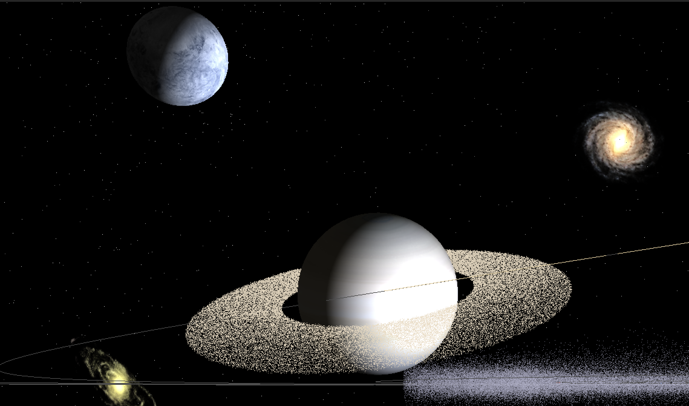
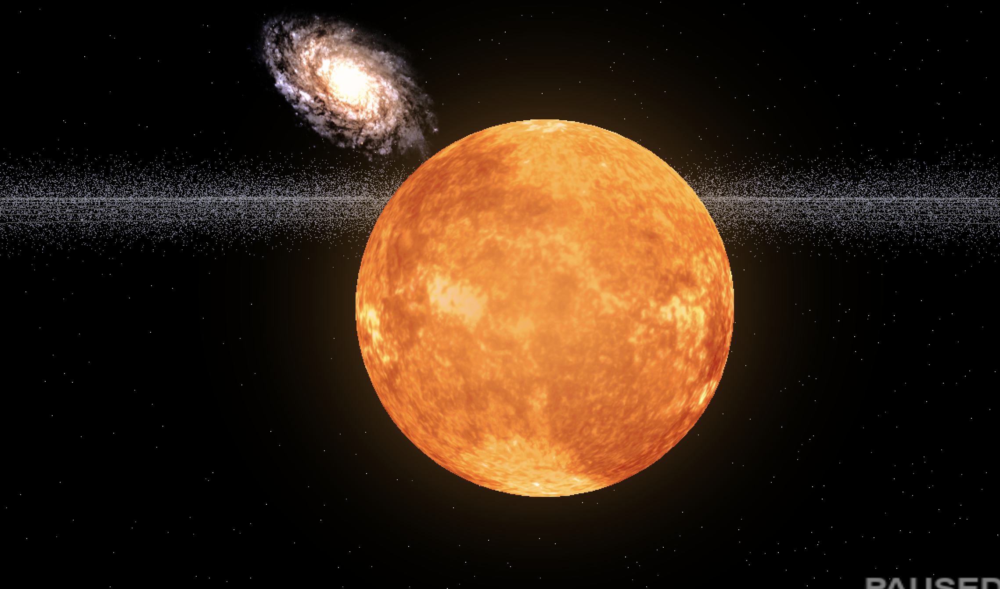
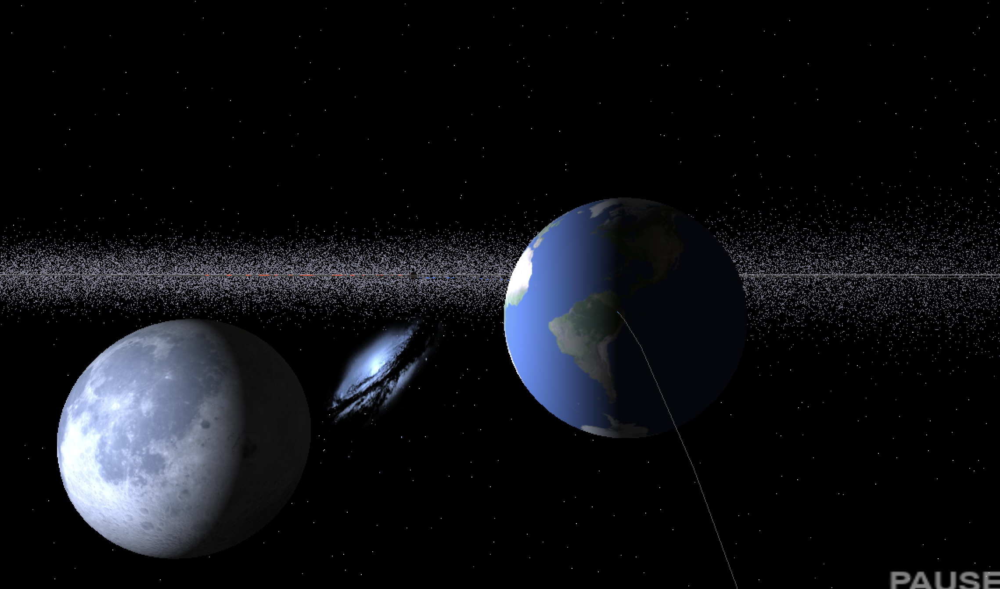

# Solar System Simulation


*(Replace this with a 5-second GIF of your simulation)*

A real-time physics simulation of the Solar System built with **Python** and **OpenGL**. This project implements a **Central Force** gravity model for planetary orbits and uses **Compute Shaders** to simulate 200,000 interacting particles in real-time.

> **⚠️ Compatibility Note:** This project was optimized specifically for **Apple M-Series GPUs** (M1/M2/M3). While it uses standard OpenGL 3.3, performance or shader compilation may vary on Windows/Linux machines with NVIDIA/AMD cards due to differences in driver implementations.

## 🎥 Project Overview
This simulation renders the Sun, 9 planets (including Pluto), and major moons, along with a particle belt of over **200,000 asteroids**. It demonstrates the application of classical mechanics and high-performance computing graphics in a scientific context.

### Key Features
* **GPU Acceleration:** Uses **ModernGL (OpenGL)** and **Vertex Shaders** to calculate physics for 200,000+ particles in parallel, offloading heavy math from the CPU to the GPU.
* **Physics Engine:** Custom gravity implementation using **Semi-Implicit Euler Integration** (a Symplectic Integrator) to guarantee orbital stability for long-duration simulations.
* **Hybrid Orbit System:**
    * **Planets:** Dynamic simulation based on Newton's Law of Gravitation ($F = G \frac{m_1 m_2}{r^2}$).
    * **Moons:** Kinematic simulation hierarchically attached to parent bodies. This prevents orbital decay due to floating-point errors during high-speed time warping.
* **Volumetric Effects:** Implements **Spherical Billboarding** for the Sun's glow, ensuring correct lighting and atmospheric effects from all camera angles.

## 📸 Visuals

| Planetary Physics | Volumetric Lighting | Orbital Details |
|:-----------------:|:-------------------:|:---------------:|
|  |  |  |
| *Saturn's rings with 80,000 particles* | *Shader-based atmospheric glow* | *Earth & Moon visualization* |

## 🛠️ Tech Stack
* **Language:** Python 3.9+
* **Graphics:** ModernGL (High-performance OpenGL bindings)
* **Math:** NumPy (Vectorized linear algebra) & GLSL (Shader Language)
* **Windowing:** Pygame

## 🚀 How to Run
1.  **Install Dependencies:**
    (A `requirements.txt` is provided with the exact frozen versions used in development)
    ```bash
    pip install -r requirements.txt
    ```
2.  **Run the Simulation:**
    ```bash
    python main.py
    ```

## 🎮 Controls
* **W, A, S, D:** Move Camera
* **Space / Ctrl:** Move Up / Down
* **Mouse:** Look around
* **L / K:** Increase / Decrease Simulation Speed
* **P:** Pause Simulation